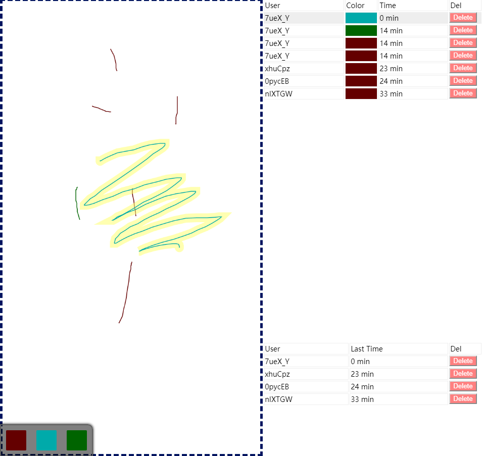

# Squig
The project is an interactive local-network canvas. There are three parts (role) in this network.

1. Server (`server.js` using NodeJS)
2. Client (`index.html` in web-browser)
3. Admin (`admin.html` in web-browser)

To run the project, you need to start the server firstly. Make sure you have [NodeJS](https://nodejs.org/) installed.

Open Terminal, use `cd` command to switch path to project folder, then execute
```
npm install
node ./dist/server.js
```
Now a web page server is running and listening to port 1080,

a websocket communication server is running and listening to port 2112

You need to figure out the IP address of the server in your local-network. 

Assuming the IP address is 192.168.1.10, then

the client's page should be `http://192.168.1.10:1080`,
the admin's page should be `http://192.168.1.10:1080/admin.html`.

Now you can draw stuffs in your canvas, admins can delete them using the panel at right.




## Build
To rebuild the project, run
```
npm install
npm run build
```